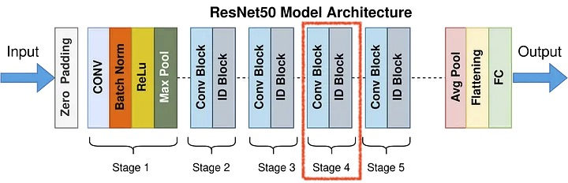
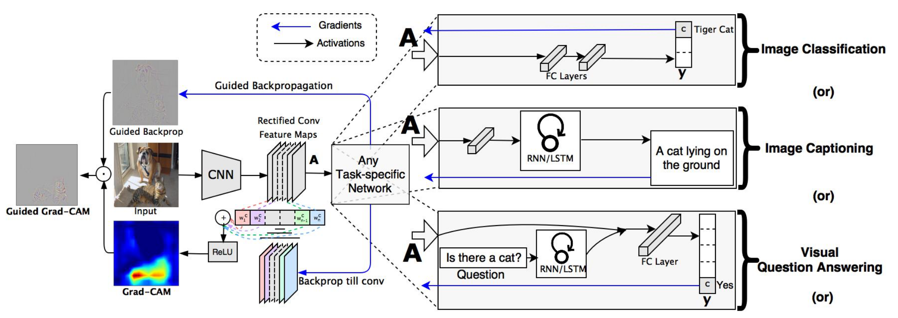
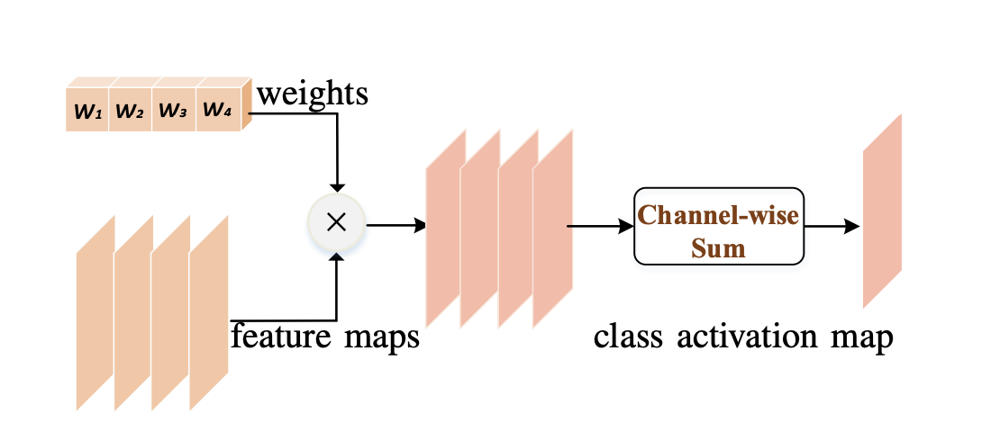
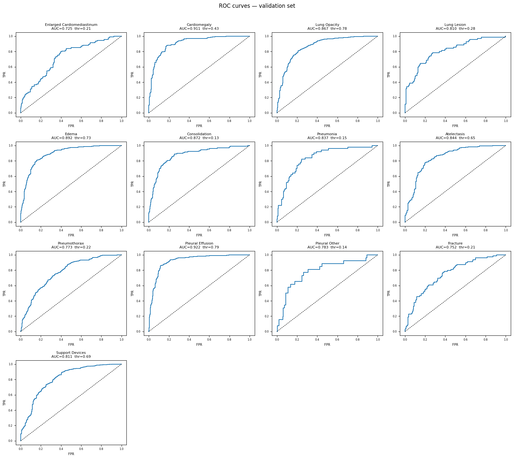
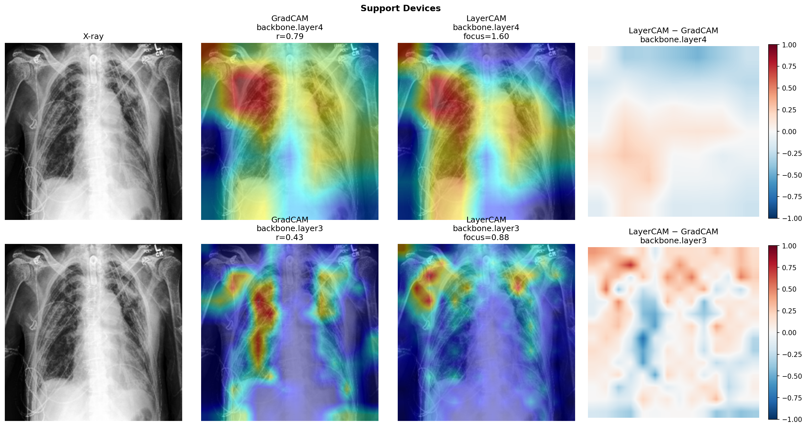
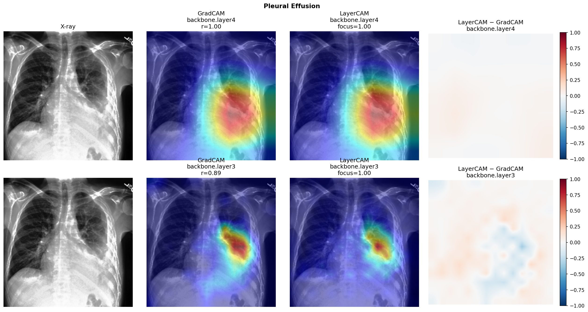
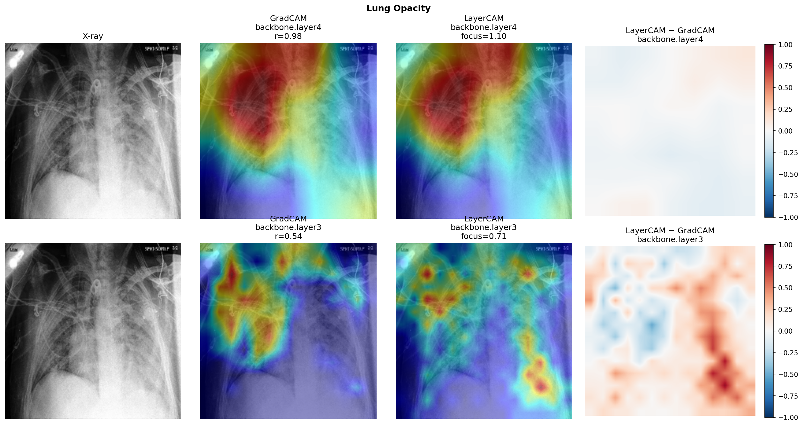
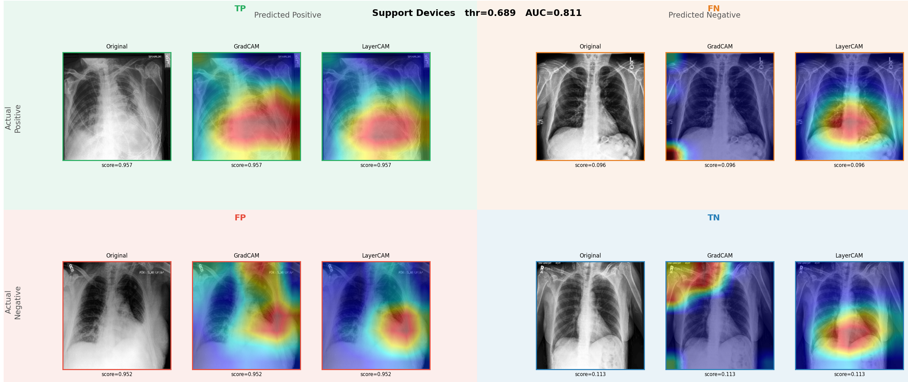
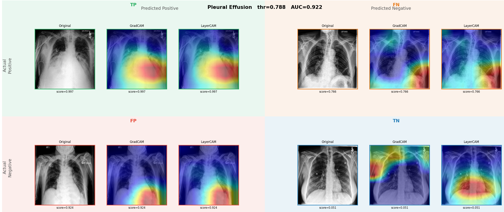
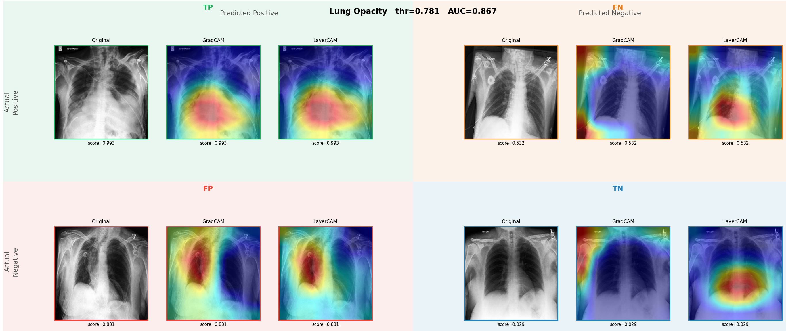

# Introduction

Explainable Artificial Intelligence (XAI) is an important step toward making deep learning models more transparent, especially in high-stakes domains such as medical imaging. In chest X-ray analysis, a classifier is not useful only because it predicts a pathology, but also because it can show which image regions led to that decision. This project explores that idea with a multi-label CheXpert classifier built on ResNet-50 and explains its predictions with Class Activation Mapping methods.

Our main focus is on LayerCAM, a CAM-based technique that produces spatially detailed heatmaps by combining activations with gradients at the feature-map level. For comparison, we also use GradCAM as a baseline to highlight the differences between coarse and fine-grained explanations. Together, these methods help reveal whether the model attends to clinically meaningful regions, which is valuable for model debugging, qualitative validation, and building trust in AI-assisted radiology workflows.

# Overview of XAI methods

XAI is a set of methods designed to make deep learning model behavior interpretable for humans. In many modern neural networks, predictions are accurate but hard to justify, which creates a gap between performance and trust. XAI addresses this gap by providing human-readable evidence for model decisions, such as feature attributions, saliency maps, counterfactual examples, or concept-level explanations.

In deep learning practice, XAI is used for more than presentation: it supports model debugging, data quality checks, bias detection, and failure analysis. Teams often use it to answer questions like: *Did the model focus on medically relevant anatomy, or on spurious artifacts?* This is especially important in high-impact applications such as healthcare diagnosis, autonomous driving, industrial inspection, and finance, where interpretability is part of safety, accountability, and deployment readiness.


# Methods

## ResNet

### Task and Data

We frame the problem as **multi-label chest X-ray classification** on CheXpert, where one image can contain several findings at once. Instead of predicting a single class, the model outputs 13 pathology probabilities (e.g., Lung Opacity, Pleural Effusion, Support Devices). This setup is closer to real clinical workflow, where co-existing conditions are common.

CheXpert labels include positive (`1`), negative (`0`), uncertain (`-1`), and missing values (`NaN`). During training, uncertain and missing labels are excluded with a valid-mask strategy, so gradients are computed only from reliable labels. Images are resized to `224×224` and normalized with ImageNet statistics.

### Model Architecture

Our baseline model is a fine-tuned **ResNet-50**. We keep the pretrained convolutional backbone and replace the classifier head with `Linear(2048, 13)` followed by sigmoid outputs, which is standard for multi-label prediction.

In short, the backbone learns hierarchical visual features (from edges and textures to pathology-level patterns), while the new head maps those features to per-pathology probabilities. This gives strong performance, but it does not directly tell us *where* evidence comes from in the image.



### Why XAI Is Needed Here

For this task, a probability alone is not enough. In medical imaging, users need to verify that the model is looking at anatomically meaningful regions, not shortcuts such as borders, markers, or acquisition artifacts. That is exactly the gap XAI methods address.

We therefore pair ResNet-50 with CAM-based explanations (GradCAM and LayerCAM). They project model evidence back to image space, allowing us to inspect whether predicted findings are supported by plausible regions. This is useful for trust, error analysis (especially FP/FN cases), and safer deployment decisions.

### Code implementation

First basic preprocessing is needed: 
1. Only frontal view of x-ray is considered
2. Labels filtering (if no finding was labeled)
3. Dropping NaNs

This data preprocessing is implemented in `preprocess.py`

```python
def preprocess_chexpert_dataframe(
        data_root: str | PathLike,
        csv_filename: str | PathLike,
        target_cols: list[str]
) -> pd.DataFrame:
    
    df = pd.read_csv(os.path.join(data_root, csv_filename))

    df = df[df["Frontal/Lateral"] == "Frontal"]
    df["Path"] = df["Path"].apply(substitute_path_root, root=data_root)
    df = df[["Path", "Sex", "Age", "No Finding"] + target_cols]

    for idx, row in df.iterrows():
        if row["No Finding"] == 1:
            df.loc[idx, target_cols] = 0

    df["No Finding"] = df["No Finding"].fillna(0)
    df = df[df[target_cols].notna().any(axis=1)]

    return df
```

To solve this problem we implemented ResNet-50 finetuning and evaluation pipeline in `CheXpertTrainer` class in `train.py` script. This pipepline implements preprocessing, model training, evaluation and logging. 

```python
class CheXpertTrainer:
    def __init__(self, config):
        self.config = config
        self.device = torch.device('cuda' if torch.cuda.is_available() else 'mps' if torch.backends.mps.is_available() else 'cpu')
        self.model = CheXpertResNet50(num_classes=config['num_classes']).to(self.device)
        
        if config['loss_type'] == 'bce':
            self.criterion = MaskedBCELoss()
        elif config['loss_type'] == 'focal':
            self.criterion = MaskedFocalLoss(alpha=config['alpha'], gamma=config['gamma'])
        else:
            raise ValueError(f"Unknown loss type: {config['loss_type']}")
        self.optimizer = optim.Adam(
            self.model.parameters(), 
            lr=config['learning_rate'],
            weight_decay=config['weight_decay']
        )
        
        self.scheduler = optim.lr_scheduler.ReduceLROnPlateau(
            self.optimizer, mode='min', patience=3, factor=0.5
        )
        
        self.writer = SummaryWriter(log_dir=config['log_dir'])
        
        self.best_val_auc = 0.0
        self.best_val_f1 = 0.0
        
    def train_epoch(self, dataloader):
        self.model.train()
        epoch_loss = 0.0
        all_predictions = []
        all_targets = []
        all_masks = []
        
        pbar = tqdm(dataloader, desc='Training')
        for batch_idx, (images, targets, valid_mask) in enumerate(pbar):
            images = images.to(self.device)
            targets = targets.to(self.device)
            valid_mask = valid_mask.to(self.device)
            
            self.optimizer.zero_grad()
            logits = self.model(images)
            
            loss = self.criterion(logits, targets, valid_mask)
            loss.backward()
            self.optimizer.step()
            
            epoch_loss += loss.item()
            with torch.no_grad():
                predictions = torch.sigmoid(logits)
                all_predictions.append(predictions.cpu().numpy())
                all_targets.append(targets.cpu().numpy())
                all_masks.append(valid_mask.cpu().numpy())
            
            pbar.set_postfix({'loss': loss.item()})
        
        all_predictions = np.concatenate(all_predictions)
        all_targets = np.concatenate(all_targets)
        all_masks = np.concatenate(all_masks)
        
        metrics = self.calculate_metrics(all_predictions, all_targets, all_masks)
        
        return epoch_loss / len(dataloader), metrics
    
    def validate_epoch(self, dataloader):
        self.model.eval()
        epoch_loss = 0.0
        all_predictions = []
        all_targets = []
        all_masks = []
        
        with torch.no_grad():
            pbar = tqdm(dataloader, desc='Validation')
            for images, targets, valid_mask in pbar:
                images = images.to(self.device)
                targets = targets.to(self.device)
                valid_mask = valid_mask.to(self.device)
                
                logits = self.model(images)
                loss = self.criterion(logits, targets, valid_mask)
                
                epoch_loss += loss.item()
                
                predictions = torch.sigmoid(logits)
                all_predictions.append(predictions.cpu().numpy())
                all_targets.append(targets.cpu().numpy())
                all_masks.append(valid_mask.cpu().numpy())
                
                pbar.set_postfix({'loss': loss.item()})
        
        all_predictions = np.concatenate(all_predictions)
        all_targets = np.concatenate(all_targets)
        all_masks = np.concatenate(all_masks)
        
        metrics = self.calculate_metrics(all_predictions, all_targets, all_masks)
        
        return epoch_loss / len(dataloader), metrics
    
    def calculate_metrics(self, predictions, targets, masks):
        metrics = {}
        
        class_aucs = []
        class_f1s = []
        
        for i in range(targets.shape[1]):
            valid_indices = masks[:, i]
            if valid_indices.sum() > 1:
                class_preds = predictions[valid_indices, i]
                class_targets = targets[valid_indices, i]
                
                if len(np.unique(class_targets)) > 1:
                    auc = roc_auc_score(class_targets, class_preds)
                    class_aucs.append(auc)
                
                class_pred_labels = (class_preds > 0.5).astype(int)
                f1 = f1_score(class_targets, class_pred_labels, zero_division=0)
                class_f1s.append(f1)
        
        metrics['auc_mean'] = np.mean(class_aucs) if class_aucs else 0.0
        metrics['f1_mean'] = np.mean(class_f1s) if class_f1s else 0.0
        
        return metrics
    
    def train(self, train_loader, val_loader, num_epochs):
        print(f"Starting training on {self.device}")
        print(f"Model parameters: {sum(p.numel() for p in self.model.parameters()):,}")
        
        for epoch in range(num_epochs):
            print(f"\nEpoch {epoch + 1}/{num_epochs}")
            train_loss, train_metrics = self.train_epoch(train_loader)
            val_loss, val_metrics = self.validate_epoch(val_loader)
            
            self.scheduler.step(val_loss)
            self.writer.add_scalar('Loss/Train', train_loss, epoch)
            self.writer.add_scalar('Loss/Val', val_loss, epoch)
            self.writer.add_scalar('AUC/Train', train_metrics['auc_mean'], epoch)
            self.writer.add_scalar('AUC/Val', val_metrics['auc_mean'], epoch)
            self.writer.add_scalar('F1/Train', train_metrics['f1_mean'], epoch)
            self.writer.add_scalar('F1/Val', val_metrics['f1_mean'], epoch)
            self.writer.add_scalar('LR', self.optimizer.param_groups[0]['lr'], epoch)
            
            print(f"Train Loss: {train_loss:.4f}, Val Loss: {val_loss:.4f}")
            print(f"Train AUC: {train_metrics['auc_mean']:.4f}, Val AUC: {val_metrics['auc_mean']:.4f}")
            print(f"Train F1: {train_metrics['f1_mean']:.4f}, Val F1: {val_metrics['f1_mean']:.4f}")
            
            if val_metrics['auc_mean'] > self.best_val_auc:
                self.best_val_auc = val_metrics['auc_mean']
                torch.save({
                    'epoch': epoch,
                    'model_state_dict': self.model.state_dict(),
                    'optimizer_state_dict': self.optimizer.state_dict(),
                    'best_auc': self.best_val_auc,
                    'config': self.config
                }, os.path.join(self.config['checkpoint_dir'], 'best_model.pth'))
                print(f"New best model saved with AUC: {self.best_val_auc:.4f}")
        
        self.writer.close()
```

Training is run through `src/train.py` with masked losses and checkpointing. Example command:

```bash
python src/train.py \
  --data_root /path/to/chexpert \
  --batch_size 32 \
  --num_epochs 50 \
  --learning_rate 1e-4 \
  --weight_decay 1e-5 \
  --loss_type bce \
  --log_dir logs \
  --checkpoint_dir checkpoints
```


## GradCAM

GradCAM is a way to connect a class prediction back to the image regions that influenced it. Instead of asking only *what* the model predicted, it helps answer *where* the model found evidence for that prediction.

GradCAM is especially useful for our ResNet-50 model because it does not require changing the architecture. We only need the last convolutional feature maps and the gradient of a chosen class score.



### Step 1: extract feature maps

The image is first passed through the CNN backbone. The last convolutional layer produces a stack of feature maps:
$$
A^k \in \mathbb{R}^{H \times W},
$$
where $k$ indexes the channel and $(H, W)$ is the spatial size.

Each feature map captures a different visual pattern, such as edges, textures, or larger anatomy-related structures.

### Step 2: choose the class score

For a target class $c$, the network produces a score $y^c$. In our project, this is one pathology probability/logit from the multi-label classifier.

To understand why the model predicted that class, GradCAM starts from $y^c$ and traces the influence of the convolutional features backward through the network.

### Step 3: compute the gradient-based importance of each feature map

GradCAM measures how strongly each feature map contributes to the selected class by looking at the gradient of $y^c$ with respect to the activation map:
$$
\frac{\partial y^c}{\partial A^k_{ij}}.
$$

These gradients are then averaged over the spatial dimensions to get one importance weight per channel:
$$
\alpha_k^c = \frac{1}{Z} \sum_i \sum_j \frac{\partial y^c}{\partial A^k_{ij}},
$$
where $Z = H \times W$.

Intuitively, $\alpha_k^c$ tells us how important feature map $k$ is for class $c$.

### Step 4: combine weights with the feature maps

Once the channel weights are known, GradCAM forms the class-specific heatmap by taking a weighted sum of the feature maps:
$$
L_{GradCAM}^c = \mathrm{ReLU}\!\left( \sum_k \alpha_k^c A^k \right).
$$

The $\mathrm{ReLU}$ keeps only positive evidence, so the final map highlights regions that support the chosen class rather than suppressing it.

### Step 5: resize and overlay the heatmap

The resulting map is still at the feature-map resolution, so it is upsampled to the input image size and overlaid on the original X-ray. This makes it easier to inspect whether the explanation aligns with anatomically meaningful areas.


### Code implementation

The model exposes the feature maps needed for GradCAM in `src/model.py`:

```python
def get_feature_maps(self, x):
    x = self.backbone.conv1(x)
    x = self.backbone.bn1(x)
    x = self.backbone.relu(x)
    x = self.backbone.maxpool(x)

    x = self.backbone.layer1(x)
    x = self.backbone.layer2(x)
    x = self.backbone.layer3(x)
    feature_maps = self.backbone.layer4(x)

    x = self.backbone.avgpool(feature_maps)
    x = torch.flatten(x, 1)
    logits = self.backbone.fc(x)

    return logits, feature_maps
```

This method returns both the final logits and the last convolutional activations. GradCAM uses the activations to build the explanation.

The core GradCAM logic is in `src/gradcam.py`:

```python
def generate_cam(self, input_tensor, target_class_idx):
    output, feature_maps = self.model.get_feature_maps(input_tensor)
    self.model.zero_grad()

    target_output = output[0, target_class_idx]
    target_output.backward(retain_graph=True)

    gradients = self.gradients[0]
    activations = self.activations[0]
    weights = torch.mean(gradients, dim=(1, 2))

    cam = torch.sum(weights[:, None, None] * activations, dim=0)
    cam = F.relu(cam)

    if cam.max() > cam.min():
        cam = (cam - cam.min()) / (cam.max() - cam.min())

    return cam.detach().cpu().numpy()
```

Here, the forward hook stores activations from the selected layer, the backward hook stores gradients, and the final heatmap is produced by weighted summation followed by normalization.

Finally, `visualize_cam()` converts the heatmap into a colored overlay on top of the original image. This is the step that makes the explanation easy to inspect visually.

## LayerCAM

LayerCAM keeps the same goal as GradCAM - highlight evidence regions for a target class, but changes how feature maps are weighted. Instead of assigning one scalar weight per channel, LayerCAM keeps gradient information at each spatial location. This usually produces sharper and more localized heatmaps.



### Step 1: extract activations and class score

As in GradCAM, we run a forward pass and capture the activation maps from a target convolutional layer:
$$
A^k \in \mathbb{R}^{H \times W},
$$
then choose the class score $y^c$ for the pathology we want to explain.

### Step 2: compute spatial gradients

We backpropagate from $y^c$ to obtain gradients at each pixel of each channel:
$$
\frac{\partial y^c}{\partial A^k_{ij}}.
$$

Unlike GradCAM, these gradients are **not** averaged over $(i,j)$.

### Step 3: keep only positive class-supporting gradients

LayerCAM uses:
$$
\mathrm{ReLU}\!\left(\frac{\partial y^c}{\partial A^k_{ij}}\right)
$$
to keep only positive evidence for the selected class.

### Step 4: apply pixel-wise weighting

Each activation pixel is weighted by its own local positive gradient:
$$
M^c_{ij} = \sum_k A^k_{ij} \cdot \mathrm{ReLU}\!\left(\frac{\partial y^c}{\partial A^k_{ij}}\right).
$$

This is the key difference from GradCAM: weighting is done at the pixel level, not channel level.

### Step 5: normalize, upsample, and overlay

The map is normalized to $[0,1]$, resized to the input image size, and visualized as an overlay. In practice, this gives more detailed spatial boundaries, especially in intermediate layers (`backbone.layer3`).

### GradCAM vs LayerCAM (before implementation)

| Aspect | GradCAM | LayerCAM |
|---|---|---|
| Channel weighting | Global average of gradients per channel: $\alpha_k^c$ | No channel collapse; keeps local gradients per pixel |
| Core formula | $L^c=\mathrm{ReLU}(\sum_k \alpha_k^c A^k)$ | $M^c_{ij}=\sum_k A^k_{ij}\,\mathrm{ReLU}(\partial y^c/\partial A^k_{ij})$ |
| Spatial detail | Coarser, more diffuse maps | Sharper, more localized maps |
| Best behavior in our study | Strong for compact findings (e.g., Pleural Effusion) | Better precision for distributed findings (e.g., Lung Opacity, Support Devices) |
| Multi-layer analysis | Supported, but often similar at deep layers | Particularly informative at shallower/intermediate layers |

### Code implementation

The core LayerCAM generation in `src/layercam.py` is:

```python
def generate_cam(self, input_tensor, target_class_idx):
    output, feature_maps = self.model.get_feature_maps(input_tensor)

    self.model.zero_grad()

    target_output = output[0, target_class_idx]
    target_output.backward(retain_graph=True)

    gradients = self.gradients[0]
    activations = self.activations[0]

    weighted_maps = F.relu(gradients) * activations
    cam = torch.sum(weighted_maps, dim=0)

    if cam.max() > cam.min():
        cam = (cam - cam.min()) / (cam.max() - cam.min())

    return cam.detach().cpu().numpy()
```

This matches the LayerCAM equation directly: positive gradients are used as local weights, then summed across channels.

For multi-layer fusion, the project provides `generate_layer_specific_cam()`:

```python
def generate_layer_specific_cam(self, input_tensor, target_class_idx, layer_names):
    layer_cams = {}

    for layer_name in layer_names:
        temp_layercam = LayerCAM(self.model, layer_name)
        cam = temp_layercam.generate_cam(input_tensor, target_class_idx)
        layer_cams[layer_name] = cam

    max_h, max_w = 0, 0
    for cam in layer_cams.values():
        h, w = cam.shape
        max_h, max_w = max(max_h, h), max(max_w, w)

    combined_cam = np.zeros((max_h, max_w))
    for cam in layer_cams.values():
        cam_resized = cv2.resize(cam, (max_w, max_h))
        combined_cam += cam_resized

    combined_cam /= len(layer_cams)
    return combined_cam, layer_cams
```

This fusion step combines coarse semantic information from deeper layers with finer spatial detail from shallower layers.


# Results & Analysis

## Model performance

On the validation set, the model reaches a **mean ROC-AUC of 0.8307** across 13 labels and **mean F1 of 0.7068** (using per-label thresholds from Youden’s $J$). We also noted clear overfitting on the 10k training subset: training AUC reaches **0.9999** by epoch 8 while validation AUC remains around **0.83**

### Per-label metrics

| Label | AUC | Threshold | F1 |
|---|---:|---:|---:|
| Enlarged Cardiomediastinum | 0.7245 | 0.2128 | 0.5382 |
| Cardiomegaly | 0.9115 | 0.4259 | 0.8477 |
| Lung Opacity | 0.8672 | 0.7812 | 0.8735 |
| Lung Lesion | 0.8098 | 0.2759 | 0.6180 |
| Edema | 0.8919 | 0.7337 | 0.8495 |
| Consolidation | 0.8722 | 0.1264 | 0.7063 |
| Pneumonia | 0.8373 | 0.1488 | 0.5857 |
| Atelectasis | 0.8442 | 0.6470 | 0.8163 |
| Pneumothorax | 0.7732 | 0.2248 | 0.5719 |
| Pleural Effusion | 0.9222 | 0.7878 | 0.8985 |
| Pleural Other | 0.7826 | 0.1399 | 0.4167 |
| Fracture | 0.7515 | 0.2110 | 0.5674 |
| Support Devices | 0.8110 | 0.6889 | 0.8986 |
| **Mean** | **0.8307** |  | **0.7068** |

Thresholds vary strongly across classes (**0.14 to 0.79**), so a single global threshold (e.g., 0.5) would under-detect rare classes such as Pneumonia and Pleural Other.



## CAM Analysis

### GradCAM vs LayerCAM across layers

We compared both methods across two ResNet layers - backbone.layer3 (shallower,
finer resolution) and backbone.layer4 (deeper) on the three most frequently
positive classes in our validation subset: **Support Devices**, **Pleural Effusion**, and
**Lung Opacity**

| Class | layer4 Pearson $r$ | layer3 Pearson $r$ | Interpretation |
|---|---:|---:|---|
| Support Devices | 0.79 | 0.43 | Divergence at shallow layer; LayerCAM narrows to upper mediastinum |
| Pleural Effusion | 1.00 | 0.89 | Near-identical maps across both layers |
| Lung Opacity | 0.98 | 0.54 | Divergence at shallow layer; LayerCAM more focal |

Per-class observations:
+ Support Devices. At layer4 both methods broadly agree (r = 0.79). At layer3
they diverge (r = 0.43): LayerCAM focuses on the upper mediastinum where de-
vices are located, while GradCAM remains diffuse across the lungs.
+ Pleural Effusion. Near-perfect agreement at both layers (r = 1.00 / 0.89); differ-
ence maps are blank. Both correctly localise to the right costophrenic angle. For
spatially compact, high-contrast pathologies the two methods are interchangeable.
+ Lung Opacity. Agreement at layer4 (r = 0.98), divergence at layer3 (r = 0.54):
LayerCAM highlights specific dense foci, GradCAM activates the lungs uniformly.

GradCAM (left) vs. LayerCAM (right) at layer3 (top) and layer4 (bottom)
for Support Devices. The layer3 divergence (r = 0.43) is clearly visible: LayerCAM
narrows to the upper mediastinum.



GradCAM vs. LayerCAM for Pleural Effusion. Both maps are nearly iden-
tical at both layers (r = 1.00 / 0.89), correctly localising to the right costophrenic angle.


GradCAM vs. LayerCAM for Lung Opacity. Layer3 divergence (r = 0.54):
LayerCAM highlights focal dense areas, GradCAM activates the lungs broadly.


### TP / FP / FN / TN CAM analysis

Additionally, we evaluate TP/FP/FN/TN examples on `backbone.layer4` with per-class optimal thresholds





In the TP cases, both methods usually point to the expected anatomical regions: the lower hemithorax for Pleural Effusion, the lung fields for Lung Opacity, and a broader mediastinal region for Support Devices. The Support Devices maps are less specific because `layer4` is too coarse for thin linear objects, so the model tends to capture overall context rather than a single tube or catheter.

In the FN cases, Support Devices is the clearest example: GradCAM becomes weak and noisy at the low score, while LayerCAM still preserves some residual local evidence in the lower chest. For Pleural Effusion, the FN example is mainly a threshold issue rather than a localisation failure.

In the FP cases, both methods often converge on the same intrathoracic region. It can be interpreted as more likely label ambiguity or co-occurrence bias than random hallucination. The Support Devices FP appears to reflect a shortcut: the model associates severe illness context with devices.

In the TN cases, both methods are least reliable. GradCAM often drifts toward borders or corners, suggesting sensitivity to artifacts or framing effects, while LayerCAM stays more within the thoracic cavity. However, in TN examples there is no single true spatial target, so these maps should be treated as qualitative rather than definitive.


### Key observations

- At deep layer (`layer4`), GradCAM and LayerCAM are often similar; at shallower layer (`layer3`), LayerCAM is typically more spatially precise.
- For **Pleural Effusion**, methods are nearly interchangeable in the shown examples (high agreement at both layers).
- For **Support Devices** and **Lung Opacity**, LayerCAM is more focused while GradCAM is more diffuse at `layer3`.
- In low-score FN cases (Support Devices, score $=0.096$), GradCAM may become less informative while LayerCAM can retain residual local evidence.
- In TN cases, GradCAM more often drifts toward borders/background; LayerCAM stays more localized, but this is not treated as guaranteed correctness without medical expertise.
- The critical difference is spatial precision at shallow layers. Grad-
CAM pools gradients globally per channel, which dilutes fine-grained spatial information
for diffuse pathologies. LayerCAM’s element-wise weighting preserves this detail, pro-
ducing sharper, more anatomically specific heatmaps, especially at layer3 and for
distributed findings like Lung Opacity and Support Devices. Both methods are representative and reliable for prominent, localised pathologies


# Conclusion

This project shows that XAI is not just a visual add-on, but a practical way to inspect whether a deep model is learning meaningful evidence in a medical setting. On CheXpert, the ResNet-50 baseline reaches a solid validation AUC, but the explanation methods reveal much more than the score alone: they show where the model looks when it predicts, misses, or overpredicts a pathology.

Across the experiments, both GradCAM and LayerCAM usually highlight the expected thoracic regions, which supports the idea that the model has learned clinically plausible cues. At the same time, the comparison shows an important difference in spatial behavior: GradCAM is more diffuse and more sensitive to global averaging, while LayerCAM is consistently more localized, especially at shallower layers. This makes LayerCAM more useful for detailed visual auditing, particularly for distributed findings such as Lung Opacity and Support Devices.

The analysis also shows that explanation quality depends on the prediction case. True positives are usually the easiest to interpret, false positives can expose label ambiguity or shortcut learning, false negatives often reveal threshold or weak-signal issues, and true negatives are the least reliable because there is no single anatomical target to localize. Taken together, these results suggest that CAM-based methods are valuable for interpreting CNNs in chest X-ray analysis, but they should be used as a complement to performance metrics rather than a replacement for them.

In short, the project confirms the main lesson of XAI in medical imaging: predictions become far more trustworthy when they are accompanied by spatial evidence that humans can inspect.

# References

- Jiang et al., *LayerCAM: Exploring Hierarchical Class Activation Maps for Localization*, 2021.
- Selvaraju et al., *Grad-CAM: Visual Explanations from Deep Networks via Gradient-based Localization*, ICCV 2017.
- Irvin et al., *CheXpert: A Large Chest Radiograph Dataset with Uncertainty Labels and Expert Comparison*, AAAI 2019.
- He et al., *Deep Residual Learning for Image Recognition*, CVPR 2016.


